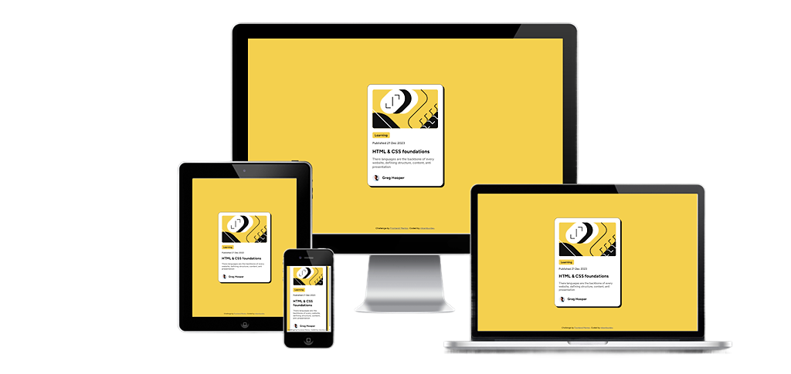

# Frontend Mentor - Blog preview card solution

This is a solution to the [Blog preview card challenge on Frontend Mentor](https://www.frontendmentor.io/challenges/blog-preview-card-ckPaj01IcS). Frontend Mentor challenges help you improve your coding skills by building realistic projects. 

## Table of contents

- [Frontend Mentor - Blog preview card solution](#frontend-mentor---blog-preview-card-solution)
	- [Table of contents](#table-of-contents)
	- [Overview](#overview)
		- [Screenshot](#screenshot)
		- [Links](#links)
	- [My process](#my-process)
		- [Built with](#built-with)
		- [What I learned](#what-i-learned)
	- [Author](#author)

## Overview

### Screenshot

### Links

- Solution URL: [URL here](https://www.frontendmentor.io/solutions/blog-preview-card-aXQfy85_wA)
- Live Site URL: [URL here](https://blog-preview-card-main-bice.vercel.app/)

## My process

### Built with

- Semantic HTML5 markup
- CSS custom properties
- SCSS - CSS preprocessor
- Flexbox
- Mobile-first workflow

### What I learned

Throughout this project, I gained practical experience with SCSS, which enhanced my understanding of CSS preprocessors and their benefits. I learned how to effectively use variables, nesting, and mixins to write more maintainable and scalable styles.

Moreover, this project allowed me to practice translating a design into code. I learned how to closely follow a given design and ensure that the final product accurately reflects the intended design. This experience has improved my attention to detail and my ability to create pixel-perfect layouts.

## Author

- Website - [bento.me/mkambur](https://bento.me/mkambur)
- Frontend Mentor - [@mkamburdev](https://www.frontendmentor.io/profile/mkamburdev)
- Twitter - [@mkambur_](https://www.twitter.com/mkambur_)
